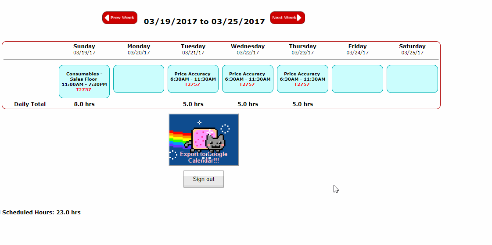

# target-schedule-exporter
This is a Chrome Extension that grabs the calendar data from Target's employee selfservice website and puts it in Google Calendar.

## Usage
If you're not logged-in to your Google account, either sign in or click the "Authorize Me!" button beneath the calendar. Then, all you need to do is click the export button.

